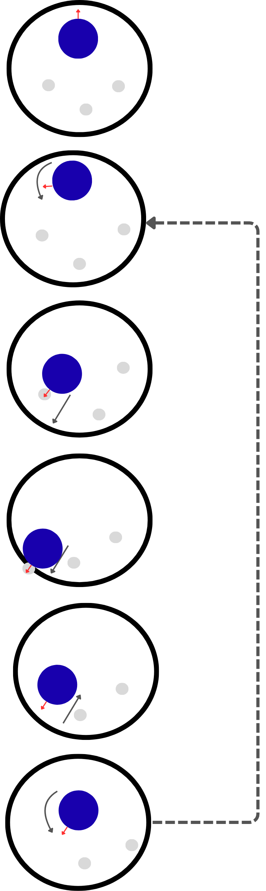

# SUMO JRG26

En este repositorio explico cómo funcionaba el algoritmo de sumo que utilizamos con mi equipo de robótica, formado por Carlos Ríos, Diego López, Martín Rincón y Sergio Toro, durante el <strong>ASTI Robotics Challenge X</strong>.

Este repositorio puede entenderse como un anexo del proyecto original, pensado para documentar con más detalle el funcionamiento del robot durante esta prueba.

## Introducción

El objetivo de esta prueba era detectar tres robots que se movían a gran velocidad dentro de una pista circular de un metro de diámetro y sacarlos del ring lo más rápido posible, evitando que nuestro propio robot se saliera.

## Hardware

Nuestro robot utiliza como cerebro un microcontrolador <strong>ESP32</strong>. Esto supone una limitación en algunos aspectos, pero también tiene ventajas importantes, especialmente por su sencillez, bajo coste y facilidad de integración.

Uno de los principales requisitos del proyecto fue diseñar un algoritmo lo más simple y robusto posible, capaz de ejecutarse periódicamente, reaccionar con rapidez y adaptarse a diferentes situaciones dentro del ring.

Para detectar a los robots contrincantes se utilizó un sensor láser de tiempo de vuelo <strong>VL53L1X</strong>. Para el movimiento de nuestro robot se emplearon motores DC con encoder, adquiridos en AliExpress.

## Software

Antes de entrar en detalle en el algoritmo de sumo, decidimos que la mejor estrategia era desarrollar nuestras propias librerías: una para realizar el control de velocidad de los motores y otra para manejar el sensor láser mediante unas pocas funciones sencillas.

De esta forma, el código principal del robot podía centrarse en la máquina de estados y en alguna funcionalidad adicional que comentaremos más adelante.

Otra de las decisiones tomadas desde el inicio fue implementar un sistema sencillo de ejecución periódica de tareas. Para ello se utilizó la librería <code>Ticker.h</code>, que nos permitió organizar ciertas funciones de forma similar a un RTOS simplificado.

El algoritmo de sumo es sencillo y se divide en las siguientes fases:

1. El robot busca un objetivo girando sobre sí mismo.
2. Cuando detecta un robot contrario, inicia un pequeño algoritmo de apuntado.
3. Una vez orientado hacia el objetivo, ataca primero a alta velocidad para alcanzarlo rápidamente.
4. Después reduce ligeramente la velocidad para evitar salirse del círculo.
5. Al finalizar el ataque, retorna a la posición de origen y vuelve a iniciar el algoritmo.

En la imagen se muestra un ejemplo simplificado del comportamiento del robot durante la prueba de sumo.

Sobre el papel, no parecía necesario implementar un algoritmo de apuntado como el que se muestra en la imagen de la derecha. La idea inicial era sencilla: en cuanto el robot detectaba al enemigo, atacaba directamente. Sin embargo, en las pruebas vimos que este comportamiento no era suficiente. Si pasábamos directamente del estado de búsqueda al estado de ataque, nuestro robot tendía a pasar de largo, golpear de lado o no impactar correctamente contra el rival.

Para resolver este problema añadimos un estado intermedio muy simple entre la detección del enemigo y el ataque. La lógica utilizada fue la siguiente:

1. **Buscamos robot** → gira a la izquierda.
2. **Robot encontrado** → sigue girando a la izquierda.
3. **Robot perdido** → gira a la derecha despacio.
4. **Robot encontrado de nuevo** → ataca.

Con este algoritmo tan simple, que fuimos calibrando de forma práctica durante las pruebas, conseguimos que los robots enemigos fueran golpeados con el centro de nuestro robot. Esto evitaba que nuestro robot se pasara de largo o que impactara de lado, aumentando bastante la eficacia del ataque.

 

## Demo

<table>
  <tr>
    <td width="400" valign="top">
      <video src="https://github.com/user-attachments/assets/4e9c40e5-cd9a-4b54-91f8-5ed8ce5cfec5" controls width="390"></video>
    </td>
    <td valign="top">
      

        La teoría ayuda a entender la lógica del algoritmo, pero lo más interesante es verlo funcionando en pruebas reales. En este vídeo se muestra el comportamiento del robot ejecutando la estrategia de búsqueda, apuntado y ataque.
      

      

        Aunque en la demo aparecen bolos en lugar de robots contrincantes, la dinámica de la prueba era muy parecida. De hecho, la prueba de tirar bolos compartía parte de la lógica con la prueba de sumo, por lo que nos sirvió para ajustar el comportamiento del robot y comprobar si el ataque se realizaba de forma centrada. En este caso mostrado, se le ha bajado la velocidad para asegurarnos de que la máquina de estados funciona y el robot está funcionando correctamente y según lo programado.
      

    </td>
  </tr>
</table>

