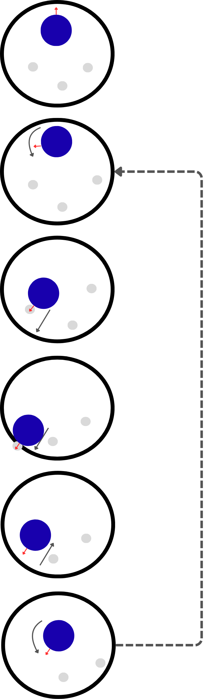

# SUMO JRG26

## 🇪🇸 Descripción del proyecto

En este repositorio explico cómo funcionaba el algoritmo de sumo que utilizamos con mi equipo de robótica, formado por Carlos Ríos, Diego López, Martín Rincón y Sergio Toro, durante el <strong>ASTI Robotics Challenge X</strong>.

Este repositorio puede entenderse como un anexo del proyecto original, pensado para documentar con más detalle el funcionamiento del robot durante esta prueba.

## Introducción

El objetivo de esta prueba era detectar tres robots que se movían a gran velocidad dentro de una pista circular de un metro de diámetro y sacarlos del ring lo más rápido posible, evitando que nuestro propio robot se saliera.

## Hardware

Nuestro robot utiliza como cerebro un microcontrolador <strong>ESP32</strong>. Esto supone una limitación en algunos aspectos, pero también tiene ventajas importantes, especialmente por su sencillez, bajo coste y facilidad de integración.

Uno de los principales requisitos del proyecto fue diseñar un algoritmo lo más simple y robusto posible, capaz de ejecutarse periódicamente, reaccionar con rapidez y adaptarse a diferentes situaciones dentro del ring.

Para detectar a los robots contrincantes se utilizó un sensor láser <strong>VL53L1X</strong>. Para el movimiento de nuestro robot se emplearon motores DC con encoder, adquiridos en AliExpress.

Con solo eso, nuestro robot ya estaba listo para combatir.

## Software

Antes de entrar en detalle en el algoritmo de sumo, decidimos que la mejor estrategia era desarrollar nuestras propias librerías: una para realizar el control de velocidad de los motores y otra para utilizar el sensor láser mediante unas pocas funciones simples, como <code>leer_valor()</code> o <code>robot_detectado(uint16_t umbral)</code>.

De esta forma, el código principal del robot podía centrarse en la máquina de estados y en alguna funcionalidad adicional que comentaremos más adelante.

Otra de las decisiones tomadas desde el inicio fue implementar un sistema de ejecución periódica de tareas. Para ello se utilizó la librería <code>Ticker.h</code>, que nos permitió organizar el código como si usáramos un RTOS, pero de forma simplificada.

El algoritmo de sumo es sencillo y se divide en las siguientes fases:

1. El robot busca un objetivo girando sobre sí mismo.
2. Cuando detecta un robot contrario, inicia un pequeño algoritmo de apuntado.
3. Una vez orientado hacia el objetivo, ataca primero a alta velocidad para alcanzarlo rápidamente.
4. Después reduce ligeramente la velocidad para evitar salirse del círculo.
5. Al finalizar el ataque, retorna a la posición de origen y vuelve a iniciar el algoritmo.

En la imagen se muestra un ejemplo simplificado del comportamiento del robot durante la prueba de sumo.

Sobre el papel, no parecía necesario implementar un algoritmo de apuntado como el que se muestra en la imagen de la derecha. La idea inicial era sencilla: en cuanto el robot detectase al enemigo, atacaría. Sin embargo, en las pruebas vimos que este comportamiento era muy poco robusto. Si pasábamos directamente del estado de búsqueda al estado de ataque, nuestro robot tendía a pasar de largo, golpear de lado o no impactar correctamente contra el rival.

Para resolver este problema, añadimos un estado intermedio muy simple entre la detección del enemigo y el ataque. La lógica utilizada fue la siguiente:

1. **Buscamos robot** → gira a la izquierda.
2. **Robot encontrado** → sigue girando a la izquierda.
3. **Robot perdido** → gira a la derecha despacio.
4. **Robot encontrado de nuevo** → ataca.

Con este algoritmo tan simple, que fuimos calibrando de forma práctica durante las pruebas, conseguimos que los robots enemigos fueran golpeados con el centro de nuestro robot. Esto evitaba que nuestro robot se pasara de largo o que impactara de lado, aumentando bastante la eficacia del ataque.

 

## Demo

<table>
  <tr>
    <td width="400" valign="top">
      <video src="https://github.com/user-attachments/assets/4e9c40e5-cd9a-4b54-91f8-5ed8ce5cfec5" controls width="390"></video>
    </td>
    <td valign="top">
      

        La teoría ayuda a entender la lógica del algoritmo, pero lo más interesante es verlo funcionando en pruebas reales. En este vídeo se muestra el comportamiento del robot ejecutando la estrategia de búsqueda, apuntado y ataque.
      

      

        Aunque en la demo aparecen bolos en lugar de robots contrincantes, la dinámica de la prueba era muy parecida. De hecho, la prueba de tirar bolos compartía parte de la lógica con la prueba de sumo, por lo que nos sirvió para ajustar el comportamiento del robot y comprobar si el ataque se realizaba de forma centrada. En el caso mostrado, se redujo la velocidad para asegurarnos de que la máquina de estados funcionaba correctamente y de que el robot se comportaba según lo programado.
      

    </td>
  </tr>
</table>

## Software de calibración

<table>
  <tr>
    <td width="400" valign="top" align="center">
      <video src="https://github.com/user-attachments/assets/45b78d5b-5e57-411d-b929-cc5a1bfe512d" controls width="390"></video>
    </td>
    <td valign="top">
      

        Esta fue una de las cosas que vimos que nos hacía falta y que era imprescindible para ganar la competición. No podíamos pasar los 20 minutos previos a la final colocando el robot en la lona, cambiando variables y recompilando continuamente el código hasta que funcionase. Decidimos que lo mejor era crear un servidor WiFi alojado en el propio microcontrolador del robot. Este servidor nos permitía cambiar los tiempos, las velocidades y algunas transiciones de nuestra máquina de estados. Esto fue fundamental, ya que nos permitía dejar al JRG listo para el combate en cuestión de tres minutos y realizar una calibración mucho más precisa.
      

      

        El servidor WiFi tiene tres botones en la parte superior: <code>START</code>, <code>STOP</code> y <code>RESET_MEF</code>. Estos botones sirven para iniciar, parar o reiniciar la máquina de estados. Para comprobar que todo funcionaba correctamente y que el robot se encontraba en el estado adecuado, también disponíamos de unos visualizadores que mostraban el estado actual de la MEF. Además, el servidor mostraba otros datos de depuración, como la distancia a la que el robot había transicionado entre los estados de búsqueda y ataque. Esto nos servía para comprobar si el robot realmente había detectado el cono o si había visto otro objeto intermedio. También era posible modificar las constantes del control de velocidad en caso de que estuviera desajustado. Al final del servidor se podían ver numerosos tiempos y velocidades configurables.
      

    </td>
  </tr>
</table>

---

## 🇬🇧 Project Description (English)

In this repository, I explain how the sumo algorithm worked for the robot we developed with my robotics team, formed by Carlos Ríos, Diego López, Martín Rincón and Sergio Toro, during the <strong>ASTI Robotics Challenge X</strong>.

This repository can be understood as an annex to the original project, intended to document the robot's behaviour during this challenge in more detail.

## Introduction

The goal of this challenge was to detect three robots moving at high speed inside a circular one-metre-diameter arena and push them out of the ring as quickly as possible, while preventing our own robot from leaving the arena.

## Hardware

Our robot uses an <strong>ESP32</strong> microcontroller as its main controller. This introduces some limitations, but it also has important advantages, especially because of its simplicity, low cost and ease of integration.

One of the main requirements of the project was to design an algorithm that was as simple and robust as possible, capable of running periodically, reacting quickly and adapting to different situations inside the ring.

To detect the opposing robots, we used a <strong>VL53L1X</strong> laser time-of-flight sensor. For the robot's movement, we used DC motors with encoders, purchased from AliExpress.

With just that, our robot was already ready to fight.

## Software

Before going into the details of the sumo algorithm, we decided that the best strategy was to develop our own libraries: one to control the motor speed and another to use the laser sensor through a few simple functions, such as <code>leer_valor()</code> or <code>robot_detectado(uint16_t umbral)</code>.

This allowed the robot's main code to focus on the state machine and on some additional functionality that will be discussed later.

Another decision made from the beginning was to implement a periodic task execution system. For this, we used the <code>Ticker.h</code> library, which allowed us to organise the code as if we were using an RTOS, but in a simplified way.

The sumo algorithm is simple and is divided into the following phases:

1. The robot searches for a target by rotating on itself.
2. When it detects an opposing robot, it starts a small aiming algorithm.
3. Once oriented towards the target, it first attacks at high speed to reach it quickly.
4. Then it slightly reduces its speed to avoid leaving the circle.
5. At the end of the attack, it returns to its original position and restarts the algorithm.

The image shows a simplified example of the robot's behaviour during the sumo challenge.

On paper, it did not seem necessary to implement an aiming algorithm like the one shown in the image on the right. The initial idea was simple: as soon as the robot detected the enemy, it would attack. However, during testing, we saw that this behaviour was not robust enough. If we switched directly from the search state to the attack state, our robot tended to miss the target, hit it from the side or fail to make proper contact with the opponent.

To solve this problem, we added a very simple intermediate state between enemy detection and attack. The logic used was the following:

1. **Searching for robot** → rotate left.
2. **Robot found** → keep rotating left.
3. **Robot lost** → rotate slowly to the right.
4. **Robot found again** → attack.

With this very simple algorithm, which we calibrated practically during testing, we managed to make the enemy robots be hit with the centre of our robot. This prevented our robot from overshooting the target or hitting it from the side, significantly increasing the effectiveness of the attack.

 

## Demo

<table>
  <tr>
    <td width="400" valign="top">
      <video src="https://github.com/user-attachments/assets/4e9c40e5-cd9a-4b54-91f8-5ed8ce5cfec5" controls width="390"></video>
    </td>
    <td valign="top">
      

        Theory helps to understand the logic behind the algorithm, but the most interesting part is seeing it working in real tests. This video shows the robot executing the search, aiming and attack strategy.
      

      

        Although the demo shows bowling pins instead of opposing robots, the dynamics of the challenge were very similar. In fact, the bowling-pin challenge shared part of its logic with the sumo challenge, so it helped us tune the robot's behaviour and check whether the attack was performed in a centred way. In the case shown, the speed was reduced to make sure that the state machine was working correctly and that the robot behaved as programmed.
      

    </td>
  </tr>
</table>

## Calibration software

<table>
  <tr>
    <td width="400" valign="top" align="center">
      <video src="https://github.com/user-attachments/assets/45b78d5b-5e57-411d-b929-cc5a1bfe512d" controls width="390"></video>
    </td>
    <td valign="top">
      

        This was one of the things we realised we needed, and it became essential to win the competition. We could not spend the 20 minutes before the final placing the robot on the arena, changing variables and continuously recompiling the code until it worked. We decided that the best solution was to create a WiFi server hosted on the robot's own microcontroller. This server allowed us to change timings, speeds and some transitions of our state machine. This was fundamental, as it allowed us to get the JRG ready for battle in about three minutes and perform a much more precise calibration.
      

      

        The WiFi server has three buttons at the top: <code>START</code>, <code>STOP</code> and <code>RESET_MEF</code>. These buttons are used to start, stop or reset the state machine. To verify that everything was working correctly and that the robot was in the right state, we also had visual indicators showing the current state of the finite state machine. The server also displayed additional debugging data, such as the distance at which the robot had transitioned between the search and attack states. This helped us check whether the robot had actually detected the cone or whether it had seen another object in between. It was also possible to modify the speed-control constants if the controller was not properly tuned. At the end of the server page, many configurable timings and speeds could be seen.
      

    </td>
  </tr>
</table>
